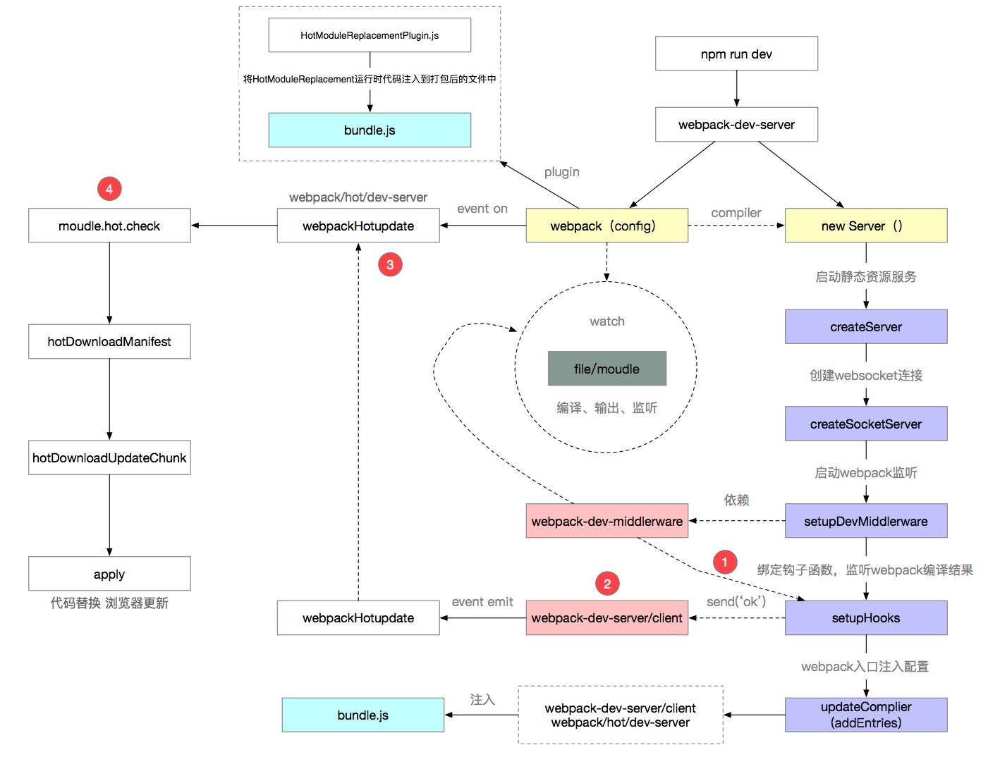
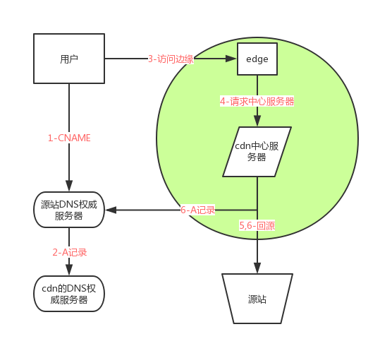

# https://q.shanyue.tech/interview.html

## app如何实现与h5通信
 
## 介绍下 npm 模块安装机制，为什么输入 npm install 就可以自动安装对应的模块？
[https://github.com/Advanced-Frontend/Daily-Interview-Question/issues/22](https://github.com/Advanced-Frontend/Daily-Interview-Question/issues/22)

## 有以下 3 个判断数组的方法，请分别介绍它们之间的区别和优劣Object.prototype.toString.call() 、 instanceof 以及 Array.isArray()
1. Object.prototype.toString.call()<br>
每一个继承 Object 的对象都有 toString 方法，如果 toString 方法没有重写的话，会返回 [Object type]，其中 type 为对象的类型。但当除了 Object 类型的对象外，其他类型直接使用 toString 方法时，会直接返回都是内容的字符串，所以我们需要使用call或者apply方法来改变toString方法的执行上下文。<br>
2. instanceof<br>
instanceof  的内部机制是通过判断对象的原型链中是不是能找到类型的 prototype。但 instanceof 只能用来判断对象类型，原始类型不可以。并且所有对象类型 instanceof Object 都是 true。<br>
3. Array.isArray()<br>
功能：用来判断对象是否为数组<br>
instanceof 与 isArray<br>
当检测Array实例时，Array.isArray 优于 instanceof ，因为 Array.isArray 可以检测出 iframes.<br>
Array.isArray() 与 Object.prototype.toString.call():<br>
Array.isArray()是ES5新增的方法，当不存在 Array.isArray() ，可以用 Object.prototype.toString.call() 实现。<br>
[https://github.com/Advanced-Frontend/Daily-Interview-Question/issues/23](https://github.com/Advanced-Frontend/Daily-Interview-Question/issues/23)

## 介绍下观察者模式和订阅-发布模式的区别，各自适用于什么场景
>在观察者模式中，观察者是知道Subject的，Subject一直保持对观察者进行记录。然而，在发布订阅模式中，发布者和订阅者不知道对方的存在。它们只有通过消息代理进行通信。<br/>
>在发布订阅模式中，组件是松散耦合的，正好和观察者模式相反。<br/>
>观察者模式大多数时候是同步的，比如当事件触发，Subject就会去调用观察者的方法。而发布-订阅模式大多数时候是异步的（使用消息队列）。<br/>
>观察者 模式需要在单个应用程序地址空间中实现，而发布-订阅更像交叉应用模式。

## 说说浏览器和 Node 事件循环的区别 
[https://github.com/Advanced-Frontend/Daily-Interview-Question/issues/26](https://github.com/Advanced-Frontend/Daily-Interview-Question/issues/26)
```js
// 例子说明
function test () {
   console.log('start')
    setTimeout(() => {
        console.log('children2')
        Promise.resolve().then(() => {console.log('children2-1')})
    }, 0)
    setTimeout(() => {
        console.log('children3')
        Promise.resolve().then(() => {console.log('children3-1')})
    }, 0)
    Promise.resolve().then(() => {console.log('children1')})
    console.log('end') 
}

test()

// 以上代码在node11以下版本的执行结果(先执行所有的宏任务，再执行微任务)
// start
// end
// children1
// children2
// children3
// children2-1
// children3-1

// 以上代码在node11及浏览器的执行结果(顺序执行宏任务和微任务)
// start
// end
// children1
// children2
// children2-1
// children3
// children3-1
```

## 介绍模块化发展历程
[https://github.com/Advanced-Frontend/Daily-Interview-Question/issues/28](https://github.com/Advanced-Frontend/Daily-Interview-Question/issues/28)

## 浏览器缓存读取规则
[https://www.jianshu.com/p/54cc04190252](https://www.jianshu.com/p/54cc04190252)

## react15与16的区别
>16新特性： render 支持返回数组和字符串 演示 <br>
>Error Boundary<br>
>createPortal<br>
>支持自定义 DOM 属性<br>
>Fiber<br>
>提升SSR渲染速度<br>
>减小文件体积<br>

## parseInt 与 Number区别
parseInt（string,radix）:将字符串解析转化为数字类型,返回的是整数；<br>
Number（object）:将对象的值转换为数字；

## proxy, reflect 与 object区别
>proxy,reflect为object提供了新的api，<br>
>proxy可以进行更多的拦截处理，高达13种，<br>
>reflect修改某些Object方法的返回结果，让其变得更合理；让Object操作都变成函数行为

## vue与react区别
> Vue 通过 getter/setter 以及一些函数的劫持，能精确知道数据变化，不需要特别的优化就能达到很好的性能<br>
> React 默认是通过比较引用的方式进行的，如果不优化（PureComponent/shouldComponentUpdate）可能导致大量不必要的VDOM的重新渲染<br>
> 数据流不同，vue1.0曾使用双向数据绑定<br>
> hoc与mixins，react曾使用mixins，现在转为高阶组件hoc<br>
> 模版渲染方式不同，vue使用的是html语法进行渲染，react使用的jsx<br>
> redux与vuex, Redux 使用的是不可变数据，而Vuex的数据是可变的。Redux每次都是用新的state替换旧的state，而Vuex是直接修改; Redux 在检测数据变化的时候，是通过 diff 的方式比较差异的，而Vuex其实和Vue的原理一样，是通过 getter/setter来比较的（如果看Vuex源码会知道，其实他内部直接创建一个Vue实例用来跟踪数据变化）

## array 与 set 区别
> 唯一性<br>
> 不可通过索引方式获取某个元素，比如let sets = new Set([5, 8, 10])； sets[0]<br>
> 还有一些操作方法不同，比如，has，add, size, clear, delete等<br>

## 观察者与发布订阅的区别
> 在观察者模式中，观察者是知道Subject的，Subject一直保持对观察者进行记录。然而，在发布订阅模式中，发布者和订阅者不知道对方的存在。它们只有通过消息代理进行通信。<br>
> 观察者模式大多数时候是同步的，比如当事件触发，Subject就会去调用观察者的方法。而发布-订阅模式大多数时候是异步的（使用消息队列）。

## 前端性能优化
> 减少http请求<br>
> 减少静态资源体积，比如使用构建工具使生产环境对静态资源进行压缩，<br>
> 使用缓存<br>
> 渲染层面，减少重排回流操作<br>
> 代码方面进行一定的性能优化<br>

## webpack优化
> alias对文件路径优化，加快webpack查找速度<br>
> publicpath如果可以使用cdn可以使用cdn,<br>
> 抽取css文件， MiniCssExtractPlugin<br>
> 代码分割按需加载、提取公共代码<br>
> 文件压缩<br>
> 暴露全局变量，比如使用的jq或者lodash、<br>
> css Tree Shaking, 清除无用的css<br>
> js Tree Shaking, 清除无用的js<br>
> DllPlugin插件打包第三方类库
> 使用happypack并发执行任务,多线程处理
> 生产环境pwa处理

## 深克隆
```js
/**
* deep clone
* @param  {[type]} parent object 需要进行克隆的对象
* @return {[type]}        深克隆后的对象
*/
const clone = parent => {
  // 维护两个储存循环引用的数组
  const parents = [];
  const children = [];

  const _clone = parent => {
    if (parent === null) return null;
    if (typeof parent !== 'object') return parent;

    let child, proto;

    if (isType(parent, 'Array')) {
      // 对数组做特殊处理
      child = [];
    } else if (isType(parent, 'RegExp')) {
      // 对正则对象做特殊处理
      child = new RegExp(parent.source, getRegExp(parent));
      if (parent.lastIndex) child.lastIndex = parent.lastIndex;
    } else if (isType(parent, 'Date')) {
      // 对Date对象做特殊处理
      child = new Date(parent.getTime());
    } else {
      // 处理对象原型
      proto = Object.getPrototypeOf(parent);
      // 利用Object.create切断原型链
      child = Object.create(proto);
    }

    // 处理循环引用
    const index = parents.indexOf(parent);

    if (index != -1) {
      // 如果父数组存在本对象,说明之前已经被引用过,直接返回此对象
      return children[index];
    }
    parents.push(parent);
    children.push(child);

    for (let i in parent) {
      // 递归
      child[i] = _clone(parent[i]);
    }

    return child;
  };
  return _clone(parent);
};
```

## webpack热更新
启动webpack，生成compiler实例，启动server，创建websocket；启动服务前，entry新增两个文件，一个client/index，为socket通信代码，,一个hot/index，主要是用于检查更新逻辑的，通过webpack-dev-server这个钩子，往前端发送最新的文件更新消息，告诉浏览器有文件已修改，触发两个事件，hash（更新最新一次打包后的hash值）和on事件（进行热更新检查），webpack-dev-middleware负责文件变化监听，主要是通过compiler.watch去监听，webpack里面有个hotModuleReplacementPlugin插件将需要运行的代码注入到打包后的文件，热更新的核心方法hotApply，删除需要替换的模块，将新的模块添加到modules中，通过__webpack_require__执行相关模块代码。<br>
[链接](https://juejin.im/post/5de0cfe46fb9a071665d3df0)<br>


## URL到页面加载完成之后发生了什么
解析url，比如协议头，端口，host等，开启网络线程发出一个完整的http请求，进行dns解析获取到ip，tcp/ip的请求构建，发生三次握手，四次挥手过程，客户端到服务器，会经过5层网络协议，应用层，传输层，网络层，数据链路成，物理层，通过这些层将报文数据等（比如，header，请求方式，请求参数等）信息输送到接收方，后台接收到后，会根据不同情况发送最新信息，同时会携带状态码，告诉前段是否请求成功，中间会发生混存处理，强缓存和协商缓存，通过请求过来的头去判断是哪种缓存，比如，cache-control/max-Age，expires属于强缓存,协商缓存有请求头，if-none-match/E-tag（处理秒级别以下的）, if-modified-since/last-modified（只能处理秒级别的缓存）,客户端接收到服务端的信息之后开始解析，html开始候检dom树，解析css，生成css树，之后将起合并生成render树，
绘制render树，将各层消息发送给GPU，GPU处理渲染，渲染时发生页面的重排与回流过程，如果有js需要对文件js代码进行初始化执行。大致流程这样，还有一些其他流程比如还有一些其他流程，图片懒加载，js异步加载等。<br>
[链接](https://zhuanlan.zhihu.com/p/34453198?group_id=957277540147056640)


## http2.0与1的区别
1.多路复用；即一个tcp/ip可以链接多个资源;
2.header压缩，减少提及;
3.二进制传输
4.服务器端推送
5.请求优先级

## 什么是https
在请求前，会建立ssl链接，确保接下来的通信都是加密的，无法被轻易截取分析

## 前段路由的实现
通过history.pushState和replaceState实现，popState监听浏览器行为[链接](https://juejin.im/post/5ac61da66fb9a028c71eae1b)

## event Bus的实现（主要考点：发布订阅模式）
[链接](https://juejin.im/post/5ac2fb886fb9a028b86e328c)
```js
class EventEmeitter {
  constructor() {
    this._events = this._events || new Map(); // 储存事件/回调键值对
    this._maxListeners = this._maxListeners || 10; // 设立监听上限
  }
}

// 触发名为type的事件

// 触发名为type的事件
EventEmeitter.prototype.emit = function(type, ...args) {
  let handler;
  handler = this._events.get(type);
  if (Array.isArray(handler)) {
    // 如果是一个数组说明有多个监听者,需要依次此触发里面的函数
    for (let i = 0; i < handler.length; i++) {
      if (args.length > 0) {
        handler[i].apply(this, args);
      } else {
        handler[i].call(this);
      }
    }
  } else { // 单个函数的情况我们直接触发即可
    if (args.length > 0) {
      handler.apply(this, args);
    } else {
      handler.call(this);
    }
  }

  return true;
};

// 监听名为type的事件
EventEmeitter.prototype.addListener = function(type, fn) {
  const handler = this._events.get(type); // 获取对应事件名称的函数清单
  if (!handler) {
    this._events.set(type, fn);
  } else if (handler && typeof handler === 'function') {
    // 如果handler是函数说明只有一个监听者
    this._events.set(type, [handler, fn]); // 多个监听者我们需要用数组储存
  } else {
    handler.push(fn); // 已经有多个监听者,那么直接往数组里push函数即可
  }
};


// 监听名为type的事件
EventEmeitter.prototype.addListener = function(type, fn) {
  // 将type事件以及对应的fn函数放入this._events中储存
  if (!this._events.get(type)) {
    this._events.set(type, fn);
  }
};

// 监听同一个事件名
emitter.addListener('arson', man => {
  console.log(`expel ${man}`);
});
emitter.addListener('arson', man => {
  console.log(`save ${man}`);
});

emitter.addListener('arson', man => {
  console.log(`kill ${man}`);
});

// 触发事件
emitter.emit('arson', 'low-end');
//expel low-end
//save low-end
//kill low-end
```

## vuex与redux区别
redux 是 flux 的一种实现，redux 不单单可以用在 react 上面。<br>
vuex 是 redux 的基础上进行改变，对仓库的管理更加明确。<br>
数据流向不一样，vuex 的同异步有不同的流向，而 redux 的同异步是一样的。<br>
redux 使用的是不可变的数据，而 vuex 的数据是可变的，redux 每次修改更新数据，其实就是用新的数据替换旧的数据，而 vuex 是直接修改原数据。<br>

## 什么是BFC
BFC（Block formatting contexts）：块级格式上下文
页面上的一个隔离的渲染区域，那么他是如何产生的呢？可以触发BFC的元素有float、position、overflow、display：table-cell/ inline-block/table-caption ；BFC有什么作用呢？比如说实现多栏布局’

IFC（Inline formatting contexts）：内联格式上下文
IFC的line box（线框）高度由其包含行内元素中最高的实际高度计算而来（不受到竖直方向的padding/margin影响)IFC中的line box一般左右都贴紧整个IFC，但是会因为float元素而扰乱。float元素会位于IFC与与line box之间，使得line box宽度缩短。 同个ifc下的多个line box高度会不同
IFC中时不可能有块级元素的，当插入块级元素时（如p中插入div）会产生两个匿名块与div分隔开，即产生两个IFC，每个IFC对外表现为块级元素，与div垂直排列。
那么IFC一般有什么用呢？
水平居中：当一个块要在环境中水平居中时，设置其为inline-block则会在外层产生IFC，通过text-align则可以使其水平居中。
垂直居中：创建一个IFC，用其中一个元素撑开父元素的高度，然后设置其vertical-align:middle，其他行内元素则可以在此父元素下垂直居中。

GFC（GrideLayout formatting contexts）：网格布局格式化上下文
当为一个元素设置display值为grid的时候，此元素将会获得一个独立的渲染区域，我们可以通过在网格容器（grid container）上定义网格定义行（grid definition rows）和网格定义列（grid definition columns）属性各在网格项目（grid item）上定义网格行（grid row）和网格列（grid columns）为每一个网格项目（grid item）定义位置和空间。那么GFC有什么用呢，和table又有什么区别呢？首先同样是一个二维的表格，但GridLayout会有更加丰富的属性来控制行列，控制对齐以及更为精细的渲染语义和控制。

FFC（Flex formatting contexts）:自适应格式上下文
display值为flex或者inline-flex的元素将会生成自适应容器（flex container），可惜这个牛逼的属性只有谷歌和火狐支持，不过在移动端也足够了，至少safari和chrome还是OK的，毕竟这俩在移动端才是王道。Flex Box 由伸缩容器和伸缩项目组成。通过设置元素的 display 属性为 flex 或 inline-flex 可以得到一个伸缩容器。设置为 flex 的容器被渲染为一个块级元素，而设置为 inline-flex 的容器则渲染为一个行内元素。伸缩容器中的每一个子元素都是一个伸缩项目。伸缩项目可以是任意数量的。伸缩容器外和伸缩项目内的一切元素都不受影响。简单地说，Flexbox 定义了伸缩容器内伸缩项目该如何布局。

## 网络攻击XSS，CSRF，如何预防
[链接](https://github.com/dwqs/blog/issues/68)<br>
xss：跨站点脚本攻击，(反射类型，存储类型，基于dom)<br>
预防：httponly防止劫持cookie；输入检查，对用户的任何输入进行检查，服务器输出检查<br>
CSRF： 跨站请求伪造，通过劫持cookir骗取服务器信任，以受害者的名义伪造请求发送到攻击的服务器。<br>
预防：验证码，添加token验证，使用referer check进行源检查（根据检查当前请求的来源Referer来判断是否是CSRF攻击）<br>

## js与原生App是如何交互的

## 前段100问
> [https://juejin.im/post/5d23e750f265da1b855c7bbe](https://juejin.im/post/5d23e750f265da1b855c7bbe)

## 前端性能优化，这些你都需要知道
[链接](https://mp.weixin.qq.com/s/QMn651mxQAKbIZVOPF5jlA)

## GET和POST的区别
区别一
GET重点从服务器上获取资源,POST重点向服务器发送数据.

区别二
get传输数据是通过URL请求，置于URL后，并用”?”连接，多个请求数据间用”&”连接.post传输数据通过Http的post机制，将字段与对应值封存在请求实体中发送给服务器，这个过程对用户是不可见的；

区别三
Get传输的数据量小，因为受URL长度限制，但效率较高；

Post可以传输大量数据，所以上传文件时只能用Post方式；

区别四
get是不安全的，因为URL是可见的，可能会泄露私密信息，如密码等；

post较get安全性较高；

区别五
get方式只能支持ASCII字符，向服务器传的中文字符可能会乱码。

post支持标准字符集，可以正确传递中文字符。

## webpack原理
[链接](https://segmentfault.com/a/1190000015088834)

## tcp与udp区别
udp:1、不会对不数据报文进行处理，直接输送；2、不仅仅支持1对1的传输，可多对多，一对多的传输；3、可靠性较差，想发就发，无需像TCP一样建立握手链接;4、头部传输小，传输高效，只有8个字节<br/>
TCP:1、TCP提供全双工通信；2、需要建立握手链接；3、可靠性强；4，仅支持1对1传输

## cdn原理
CDN做了两件事，一是让用户访问最近的节点，二是从缓存或者源站获取资源。<br>
用户在首次访问 https://assets-cdn.github.com/pinned-octocat.svg , 假设不委托local DNS服务器递归查询，会经历以下几个过程

1.浏览器检查本地有没有这个东东的有效缓存，有则使用缓存，没有有效缓存则进行对assets-cdn.github.com的DNS查询，获得一个 CNAME记录, igithub.map.fastly.net,值得注意的是，多个加速域名可以解析到同一个CNAME，CDN回源和缓存的时候考虑到了hostname，👍；<br>
2.进行对github.map.fastly.net的DNS查询，获得一个A/AAAA记录，给出地址103.245.222.133（视网站不同返回的不一样，可以有多个）, 这一步对CDN来说时十分重要的，它给出了离用户最近的边缘节点；<br>
3.浏览器选一个返回的地址，然后进行真正的http请求，开始向103.245.222.133握手，握手完了把http请求头也发给了该边缘服务器;<br>
边缘服务器检查自己的cache里面有没有https://assets-cdn.github.com/pinned-octocat.svg这个资源，有则返回给用户，如果没有，向CDN中心服务器发起请求;<br>
4.CDN中心服务器检查自己的cache里面有没有这个资源，有则返回给边缘服务器，没有则回源;<br>
5.中心服务器发现客户配置了github.map.fastly.net的回源地址(这个只有cdn会知道，假设是xxx.xxx.xxx.xxx)，就把http请求发到源站地址上，源站返回后返回给请求方;<br>


个人理解：浏览器检查本地有没有当前域名的缓存，有就使用缓存，没有就去通过dns查询获得一个记录，通过查询得到一个最近的边缘节点，，然后浏览器进行一个真正的http请求，边缘服务器铜鼓请求查看请求头的cache里面有没有当前资源，，有就返回，没有的话就把请求发到真正的资源站上，获取最新的资源。


## 为什么要有reack hook的出现
根据官方网站的描述，react动机有3点：1、使组件之间复用逻辑变得更加简单，避免代码的冗余，使代码逻辑变得更加清晰；2、将组建相关联的逻辑拆分成更小的部分，忽略了生命周期的操作，但又遵循了原则，易于代码维护；3、避免了使用class去生成组件，通过函数的方式生成组件，使函数组件在非class的情况下也可以拥有更多的react特性

## 跨域时如何处理cookie
前端加上配置：<br>
xhrFields: {
        withCredentials: true 
},<br>
服务端加上配置：<br>
header('Access-Control-Allow-Credentials: true');<br>

## 箭头函数与手写函数的区别
1. 箭头函数没有prototype(原型)，所以箭头函数本身没有this
2. 箭头函数的this指向在定义的时候继承自外层第一个普通函数的this。
3. 不能直接修改箭头函数的this指向
4. 没有自己的arguments
5. 因为没有this，不能生成构造函数

## 什么是JWT
JSON Web Token（简称 JWT）是目前最流行的跨域认证解决方案。<br>
是一种认证授权机制。<br>
JWT 认证流程：<br>
用户输入用户名/密码登录，服务端认证成功后，会返回给客户端一个 JWT<br>
客户端将 token 保存到本地（通常使用 localstorage，也可以使用 cookie）<br>
当用户希望访问一个受保护的路由或者资源的时候，需要请求头的 Authorization 字段中使用Bearer 模式添加 JWT，其内容看起来是下面这样<br>

作者：秋天不落叶
链接：https://juejin.im/post/5e055d9ef265da33997a42cc
来源：掘金
著作权归作者所有。商业转载请联系作者获得授权，非商业转载请注明出处。

## Token 和 JWT 的区别
相同：<br>

都是访问资源的令牌<br>
都可以记录用户的信息<br>
都是使服务端无状态化<br>
都是只有验证成功后，客户端才能访问服务端上受保护的资源<br>

区别：<br>

Token：服务端验证客户端发送过来的 Token 时，还需要查询数据库获取用户信息，然后验证 Token 是否有效。<br>
JWT： 将 Token 和 Payload 加密后存储于客户端，服务端只需要使用密钥解密进行校验（校验也是 JWT 自己实现的）即可，不需要查询或者减少查询数据库，因为 JWT 自包含了用户信息和加密的数据。<br>

## 事件循环
宏任务：<br>
script(整体代码)；
setTimeout；
setInterval；
setImmediate；
I/O；
UI render；<br>
微任务：<br>
process.nextTick;
Promise;
Async/Await(实际就是promise);
MutationObserver(html5新特性);<br>

node 和 浏览器 eventLoop的主要区别：<br>
两者最主要的区别在于浏览器中的微任务是在每个相应的宏任务中执行的，而nodejs中的微任务是在不同阶段之间执行的。<br>
https://juejin.im/post/5e5c7f6c518825491b11ce93

## promise、async await、Generator的区别
async 基于promise写的，代码书写方式看起来是同步的，generator需要执行next才可以执行到下一步

## es5与es6继承区别
ES5 的继承，实质是先创造子类的实例对象this，然后再将父类的方法添加到this上面（Parent.apply(this)）。<br>
ES6 的继承机制完全不同，实质是先将父类实例对象的属性和方法，加到this上面（所以必须先调用super方法）
，然后再用子类的构造函数修改this。

## js模块化（commonjs/AMD/CMD/ES6）
commonjs： require方式，nodejs推荐的方式；<br>
AMD： requirejs， 依赖前置；<br>
CMD：Seajs，依赖就近；<br>
ES6 module: exports/import <br>
commonjs与es6 module区别：<br>
CommonJS 加载的是一个对象（即module.exports属性），该对象只有在脚本运行完才会生成。而 ES6 模块不是对象，它的对外接口只是一种静态定义，在代码静态解析阶段就会生成。<br>
https://juejin.im/post/5aaa37c8f265da23945f365c


## http状态码

## cache-control有哪些值，分别干嘛的

## 浏览器缓存机制

## 加密？

## 实现一个promise

## 实现一个图片懒加载

## 实现一个v-model

## 手写ajax

## 继承

## 单例模式

 


