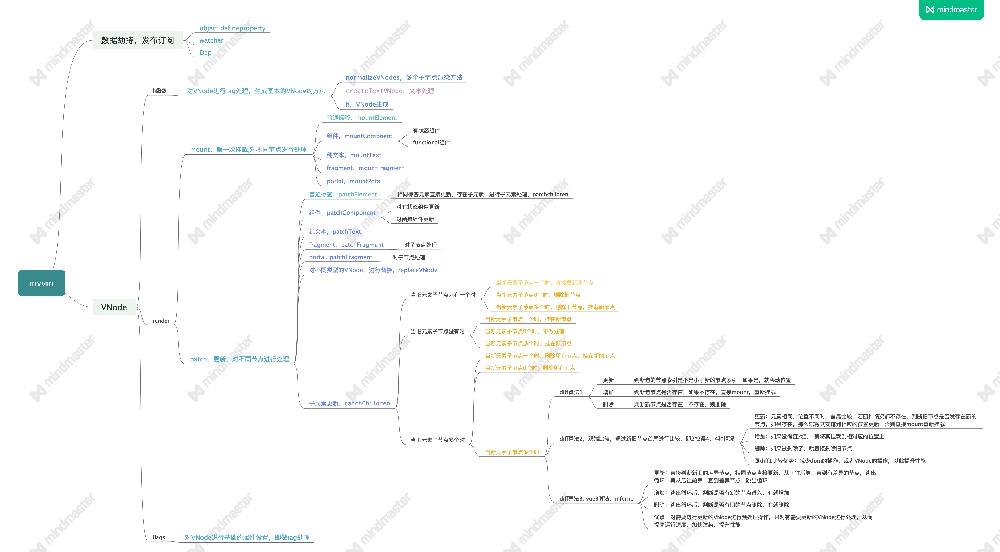

## vue实现原理

vue实现方面主要分为两部分，一部分处理数据，即set，get方面的处理，另一部分为渲染部分。处理数据方面，是通过object.defineProperty方法对数据进行拦截处理，其中使用的发布订阅的模式，形成监听作用，里面存在两个方法，一个watcher，一个Dep，这两个方法用于对数据更新时进行依赖搜集，从而去触发渲染的部分。渲染部分，vue将template模板进行了ast处理，将各个标签元素进行tag处理，形成vnode，从而更方便的去编译形成真实的dom, 渲染主要有两个函数，一个mount，一个patch，同层级与同层级比较，mount是直接挂载，patch是用于vnode的更新操作，更新操作较为复杂的部分是子元素的更新，分为9中情况，即0对1，0对0，0对多，1对0，1对1，1对多，多对0，多对1，多对多，其中最为复杂的是多对多，多对多一般都有key来判断唯一性，需要进行diff计算从而提高渲染性能，diff有3种算法： 1: 新旧节点循环，通过key判断，遍历更新节点，对需要移动的位置进行移动；2.双端比较的方式，跟第一种算法的优势是，可减少计算次数，减少移动操作，主要有四种理想情况，还有非理想情况，理想情况下，头头，头尾，尾尾，尾头进行比较，找到了就进行patch操作，没找到就进行重新挂载； 3.第三种，inferno算法，vue3.0的算法。

## 所遇到的坑

## vuex设计思想

## vue与react区别

## 在 Vue 中，子组件为何不可以修改父组件传递的 Prop，如果修改了，Vue 是如何监控到属性的修改并给出警告的。
[答案](https://github.com/Advanced-Frontend/Daily-Interview-Question/issues/60)

## 面试题汇总
> [vue面试题总汇](https://juejin.im/post/59ffb4b66fb9a04512385402) 
> [面试必备的13道可以举一反三的Vue面试题](https://juejin.im/post/5d41eec26fb9a06ae439d29f#heading-16) 
> [「面试题」20+Vue面试题整理](https://juejin.im/post/5e649e3e5188252c06113021) 
> [30 道 Vue 面试题，内含详细讲解（涵盖入门到精通，自测 Vue 掌握程度）](https://juejin.im/post/5d59f2a451882549be53b170) 